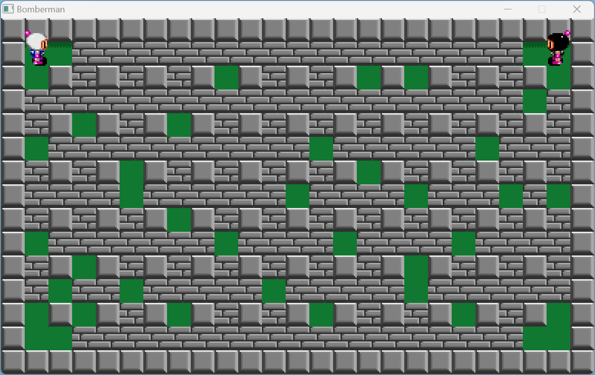

## Bomberman

### Description

A simple Bomberman clone built using the raylib library in C for learning purposes.  
The game involves navigating a tilemap, placing bombs, and defeating the other player while avoiding explosions. The game supports multiple players, animated character sprites and sound effects.

### Controls

Keyboard:
 - White Bomberman uses the arrow keys
 - White Bomberman uses the ENTER key to place bombs
 - Black Bomberman uses the WASD keys
 - Black Bomberman uses the SPACE key to place bombs

## Supported Platforms
Supports the main 3 desktop platforms:
* Windows
* Linux
* MacOS

# VSCode Users (all platforms)
*Note* You must have a compiler toolchain installed in addition to vscode.

* Download the game
* Open the folder in VSCode
* Run the build task ( CTRL+SHIFT+B or F5 )

# Windows Users
There are two compiler toolchains available for windows, MinGW-W64 (a free compiler using GCC), and Microsoft Visual Studio
## Using MinGW-W64
* Double click the `build-MinGW-W64.bat` file
* CD into the folder in your terminal
* run `make`

### Note on MinGW-64 versions
Make sure you have a modern version of MinGW-W64 (not mingw).
The best place to get it is from the W64devkit from
https://github.com/skeeto/w64devkit/releases
or the version installed with the raylib installer
#### If you have installed raylib from the installer
Make sure you have added the path

`C:\raylib\w64devkit\bin`

To your path environment variable so that the compiler that came with raylib can be found.

DO NOT INSTALL ANOTHER MinGW-W64 from another source such as msys2, you don't need it.

## Microsoft Visual Studio
* Run `build-VisualStudio2022.bat`
* double click the `.sln` file that is generated
* develop your game
* you are good to go

# Linux Users
* CD into the build folder
* run `./premake5 gmake2`
* CD back to the root
* run `make`
* you are good to go

# MacOS Users
* CD into the build folder
* run `./premake5.osx gmake2`
* CD back to the root
* run `make`
* you are good to go

# Output files
The built code will be in the bin dir

# Working directories and the resources folder
The example uses a utility function from `path_utils.h` that will find the resources dir and set it as the current working directory. This is very useful when starting out. If you wish to manage your own working directory you can simply remove the call to the function and the header.

### License
Copyright (c) 2020-2024 Jeffery Myers

This software is provided "as-is", without any express or implied warranty. In no event 
will the authors be held liable for any damages arising from the use of this software.

Permission is granted to anyone to use this software for any purpose, including commercial 
applications, and to alter it and redistribute it freely, subject to the following restrictions:

  1. The origin of this software must not be misrepresented; you must not claim that you 
  wrote the original software. If you use this software in a product, an acknowledgment 
  in the product documentation would be appreciated but is not required.

  2. Altered source versions must be plainly marked as such, and must not be misrepresented
  as being the original software.

  3. This notice may not be removed or altered from any source distribution.
 